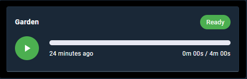
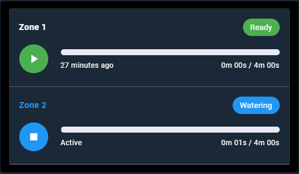
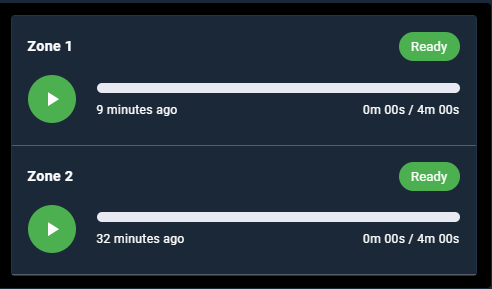
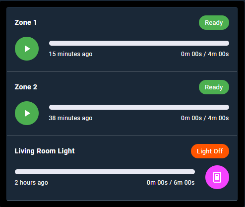

# Switch and Timer Bar Card

A flexible Lovelace card for Home Assistant that allows you to control a switch, manage an associated timer, and track its progress with a visual bar. It is perfect for automations that require timing and status tracking, such as irrigation systems, pool pumps, or charging stations.



*(Note: This is an example image. You should add a screenshot of your own card here.)*

## ✨ Features

- **Switch and Timer Control:** Turn a switch on/off and start/stop the associated timer from a single interface.
- **Visual Progress Bar:** Visually track how long the timer has been active and how much time is left.
- **Last Run Information:** Display when the device last ran and for how long, via a sensor.
- **Deep Customization:** Personalize all **colors, icons, and texts** on the card through YAML.
- **Global and Per-Entity Settings:** Define default settings for the entire card and override them for specific entities.
- **Localization (i18n) Support:** Easily translate the card into your own language using the `labels` configuration.
- **Optional Entities:** You can use the card even if you only have a switch; a timer and sensor are not required.

## 📋 Prerequisites

- **Home Assistant:** The card is designed to run on Home Assistant.
- **`timer` Integration:** To use the timer functionality, you must have timers created with the `timer` integration in Home Assistant.
- **(Optional) `sensor` Integration:** To display the "last run" information, you will need a sensor that records the date/time whenever the switch turns off. This is typically done with an automation.

## 🚀 Installation

### HACS (Recommended Method)

1.  Navigate to HACS > Frontend.
2.  Click the three dots in the top right corner and select "Custom repositories".
3.  Paste the URL of this card's GitHub repository, select "Lovelace" (or "Frontend") as the category, and click "Add".
4.  Find the `Switch and Timer Bar Card` in the list and click the "Install" button.

### Manual Installation

1.  Download the latest `switch-and-timer-bar-card.js` file from the repository's "Releases" section.
2.  Copy the file to the `www` folder in your Home Assistant configuration directory. (Create the `www` folder if it doesn't exist).
3.  From the Home Assistant UI, go to Settings > Dashboards.
4.  Click the three dots in the top right and select "Resources".
5.  Click the "Add Resource" button.
6.  Enter `/local/switch-and-timer-bar-card.js` as the URL and select "JavaScript Module" as the Resource Type.
7.  Click the "Create" button and refresh your browser.

## ⚙️ Configuration

To add the card to your Lovelace dashboard, click "Add Card", choose "Manual", and use the YAML configuration below.

### Configuration Options

| Option | Description | Type | Required | Default |
| :--- | :--- | :--- | :--- | :--- |
| `type` | The type of the card. Must be `custom:switch-and-timer-bar-card`. | `string` | **YES** |
| `title` | The main title to be displayed at the top of the card. | `string` | No | |
| `entities` | A list of devices to be displayed. | `list` | **YES** |
| `switch` | The entity ID of the switch to be controlled. | `string` | **Yes** | |
| `name` | The name to display for the device. If not specified, the `friendly_name` of the switch is used. | `string` | No | The switch's name |
| `timer` | The entity ID of the timer associated with the switch. | `string` | No | the timer you want to use |
| `sensor` | The entity ID of the sensor that stores the last run time. | `string` | No | the sensor you want to use |
| `button_position` | Used to override the global settings specifically for this entity. | `string` / `object` | No | Please see the below examples |
| `colors`| Used to override the global settings specifically for this entity. | `string` / `object` | No | Please see the below examples |
| `icons` | Used to override the global settings specifically for this entity. | `string` / `object` | No | Please see the below examples |
| `labels`| Used to override the global settings specifically for this entity. | `string` / `object` | No | Please see the below examples |

### 🛠️ Example YAML Configurations

#### Minimal Example
To get the card running quickly with only the required fields:

```
type: custom:switch-and-timer-bar-card
entities:
  - name: Garden
    switch: switch.zone_1
    timer: timer.zone_1_timer
    sensor: sensor.zone_1_is_finished

```


#### Example with Default Values Applying to All Entities
```
type: custom:switch-and-timer-bar-card
title: ''
button_position: left
colors:
  on: '#2196F3'
  ready: '#4CAF50'
  unavailable: '#F44336'
  button_start: '#4CAF50'
  button_stop: '#2196F3'
  icon: 'white'
  progress_fill: '#2196F3'
icons:
  start: 'mdi:play'
  stop: 'mdi:stop'
labels:
  status_on: 'Watering'
  status_ready: 'Ready'
  status_unavailable: 'Unavailable'
  last_on_active: 'Active'
  last_on_now: 'Just now'
  last_on_ago_minutes: 'minutes ago'
  last_on_ago_hours: 'hours ago'
  last_on_ago_days: 'days ago'
  time_format_zero: '0m 00s'
  time_unit_minutes: 'm'
  time_unit_seconds: 's'
entities:
  - name: Zone 1
    switch: switch.zone_1
    timer: timer.zone_1_timer
    sensor: sensor.zone_1_is_finished
  - name: Zone 2
    switch: switch.zone_2
    timer: timer.zone_2_timer
    sensor: sensor.zone_2_is_finished
```



#### Example for Entity Based Modification (Please see the entity zone 2)
```
type: custom:switch-and-timer-bar-card
title: ''
button_position: left
colors:
  on: '#2196F3'
  ready: '#4CAF50'
  unavailable: '#F44336'
  button_start: '#4CAF50'
  button_stop: '#2196F3'
  icon: 'white'
  progress_fill: '#2196F3'
icons:
  start: 'mdi:play'
  stop: 'mdi:stop'
labels:
  status_on: 'Watering'
  status_ready: 'Ready'
  status_unavailable: 'Unavailable'
  last_on_active: 'Active'
  last_on_now: 'Just now'
  last_on_ago_minutes: 'minutes ago'
  last_on_ago_hours: 'hours ago'
  last_on_ago_days: 'days ago'
  time_format_zero: '0m 00s'
  time_unit_minutes: 'm'
  time_unit_seconds: 's'
entities:
  - name: Zone 1
    switch: switch.zone_1
    timer: timer.zone_1_timer
    sensor: sensor.zone_1_is_finished
  - name: Zone 2
    switch: switch.zone_2
    timer: timer.zone_2_timer
    sensor: sensor.zone_2_is_finished
  # This entity overrides some global settings
  - name: Living Room Light
    switch: switch.zone_3
    timer: timer.zone_3_timer
    sensor: sensor.zone_3_is_finished
    button_position: right # Only this entity's button will be on the right
    colors:
      button_start: '#F443FF' # Only this entity will be purple when active
      ready: '#FF5500' # Only this entity will be orange when active
    icons:
      start: 'mdi:light-switch' # Use a custom start icon
    labels:
      status_ready: 'Light Off' # Use a custom status text
```
      

## License
This project is licensed under the MIT License. See the LICENSE file for details.
